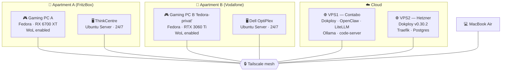

# 🏠 Homelab

> A two-apartment homelab built around one goal: use my gaming PC from anywhere.

This repo documents what I've built, why I built it, the problems I ran into, and how I actually use it day to day. It's a living document — I update it as the setup evolves.

---

## 🎯 The Goal

I split my time between two apartments about 13 km apart (and occasionally travel / stay in hotels). I wanted:

- A **24/7 server** in each apartment that's always reachable.
- The ability to **wake and stream my gaming PC remotely** — no leaving it running 24/7.
- A **secure remote-access layer** to manage everything from anywhere.
- A path from "two PCs in two rooms" to something that behaves like **one network**.

The core workflow:

> Apartment A → Tailscale → 24/7 server in Apartment B → Wake-on-LAN → gaming PC in B → Sunshine/Moonlight streaming → shut the PC down again.

---

## 🗺️ Topology

All devices are joined to a single **Tailscale** mesh, which gives me flat, encrypted access between apartments and the cloud without opening any inbound ports.

---

## 🧰 Hardware

| Device | Role | OS | Notes |
|---|---|---|---|
| **Gaming PC A** | Workstation / gaming | Fedora | AMD RX 6700 XT, WoL in BIOS |
| **ThinkCentre** | Always-on server (A) | Ubuntu Server | 24/7 |
| **Gaming PC B** ("fedora-privat") | Gaming rig | Fedora | NVIDIA RTX 3060 Ti, WoL in BIOS |
| **Dell OptiPlex** | Always-on server (B) | Ubuntu Server | 24/7 |
| **MacBook Air** | Daily client | macOS | Primary SSH / Moonlight client |
| **VPS1 (Contabo)** | Self-hosting | — | 24 GB RAM, 8 vCPU |
| **VPS2 (Hetzner)** | Self-hosting | — | 4 GB RAM, 2 vCPU |

---

## 🧱 Software Stack

**Remote access & networking**
- **Tailscale** — mesh VPN across all nodes (SSH, server admin, streaming).
- Wake-on-LAN via the always-on servers to boot the gaming PCs on demand.

**Streaming**
- **Sunshine** (host) + **Moonlight** (client) for low-latency game streaming.

**Self-hosted services (VPS)**
- **Dokploy** — deployment platform (Traefik reverse proxy, Postgres).
- **OpenClaw** — personal AI assistant / automation gateway.
- **LiteLLM** — unified LLM API proxy.
- **Ollama** — local models.
- **code-server** — browser-based VS Code.
- **Vikunja** — task management.
- **WGER** — fitness/nutrition tracking.
- Plus a handful of other self-hosted apps.

---

## 🔄 How I Use It

1. I'm in Apartment A and want to game on the stronger rig in B.
2. Connect the MacBook to **Tailscale**.
3. SSH into the always-on server in B and send a **Wake-on-LAN** magic packet.
4. Once the gaming PC is up, start **Moonlight** and stream.
5. When done, shut the PC down remotely — nothing stays running unnecessarily.

The same pattern works for remote work sessions, hotel stays, or grabbing a file from either apartment.

---

## 🧗 Problems I Ran Into

Real issues, honestly documented:

- **Wake-on-LAN reliability** — the biggest headache. Needs the NIC/BIOS configured correctly on both ends, and a reliable always-on "jump" host in the target network. <!-- TODO: add specifics -->
- **Tailscale SSH re-confirmation** — after a container restart, the SSH session sometimes needs to be re-approved in the browser. <!-- TODO: details -->
- **Latency for remote gaming** — ~13 km over Tailscale is usually fine, but I keep an eye on it and I'm evaluating a dedicated **WireGuard site-to-site** tunnel to avoid any dependence on (and overhead from) Tailscale for streaming. <!-- TODO: latency numbers -->
- **Two separate NAT'd networks** — Apartment A (FritzBox) and B (Vodafone) are independent; a mesh VPN is the simplest way to bridge them without port forwarding.
- **Dokploy / self-hosting wrinkles** — <!-- TODO: what exactly bit you here? -->

> **TODO:** Fill in the specifics — exact error messages, fixes, and "gotchas" are the most valuable part of a repo like this.

---

## 🛣️ Roadmap

- [ ] Evaluate **WireGuard site-to-site** as a Tailscale alternative (or complement) for streaming.
- [ ] Add monitoring / uptime alerts for the servers.
- [ ] Add a **subnet router** so non-Tailscale devices can be reached.
- [ ] Reverse proxy + proper TLS for all self-hosted services.
- [ ] Documentation pass: per-device setup notes, configs (sanitized).

---

## 📚 Lessons Learned

- An **always-on low-power box** in each location is worth more than any single piece of hardware — it's the anchor for WoL, streaming, and management.
- **Don't over-rely on one overlay network.** Convenience is great, but understanding the fallback path matters.
- Document as you go. Future-you will not remember why something is configured the way it is.

---

## 📄 License

<!-- TODO: pick one, e.g. MIT, or "All rights reserved" -->
MIT
